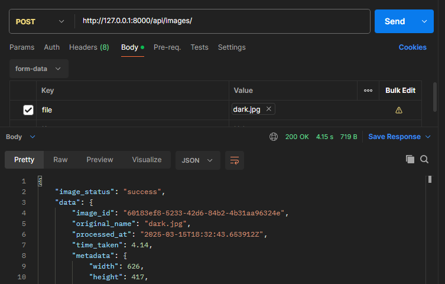
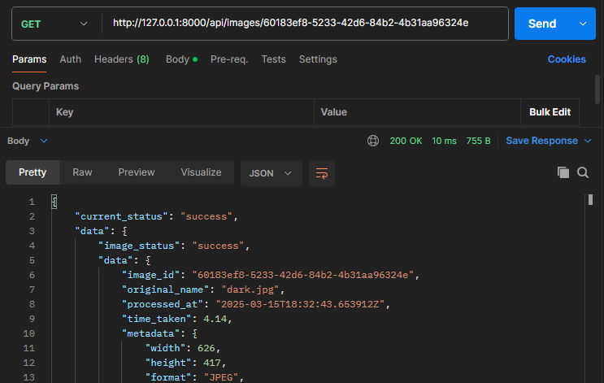
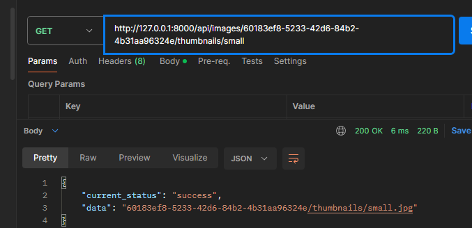

# image_processing_api
This project is a FastAPI-based image processing pipeline API that automatically processes images, generates thumbnails, extracts  metadata, and provides analysis through API endpoints.

## Project Overview

## Installation Steps
Follow the steps to set up the project on your local machine.

### Prerequisites
- Python 3.8 or higher
- pip
- [Postman](https://www.postman.com/downloads/)

### Steps
1. **Clone this repository**
```
git clone https://github.com/your-username/your-repo-name.git
cd your-repo-name
```

2. **Install Dependencies**
```
pip install -r requirements.txt
```

3. **Start the FastAPI server**</b>
You can open the code in VSCode and run the code, or you can run the code in CMD, with the command "python3 main.py"</b>
The API will be available at http://localhost:8000 or http://127.0.0.1:8000

##  Documentation/ API Documentation

## Example Usage
All of these are done in Postman:
### Upload an Image</b>
Send a **POST** request to **/api/images** with an image file to process it.
- In Postman, in the Body tab, for form-data input, include the **Key** as "file" and **Value* as an uploaded file in your local machine.


### Get All Processed Image Details</b>
Send a **GET** request to **/api/images** to retrieve all images and their metadata details.

### Get a Specific Processed Image Details</b>
Send a **GET** request to **/api/images/{image_id}** to retrieve that image's metadata details.


### Get Thumbnails
Send a **GET** request to **/api/images/{image_id}/thumbnails/{size} to retrieve a thumbnail (small or medium).


## References:
- https://huggingface.co/Salesforce/blip-image-captioning-base
- https://code.visualstudio.com/docs/python/tutorial-fastapi
- https://en.wikipedia.org/wiki/List_of_HTTP_status_codes
- https://docs.python.org/3/library/uuid.html
- https://docs.vultr.com/python/examples/get-file-creation-and-modification-date
