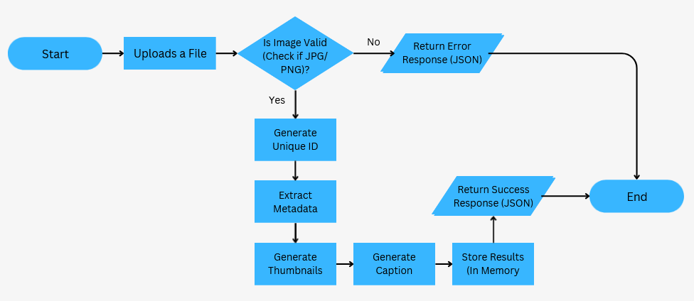
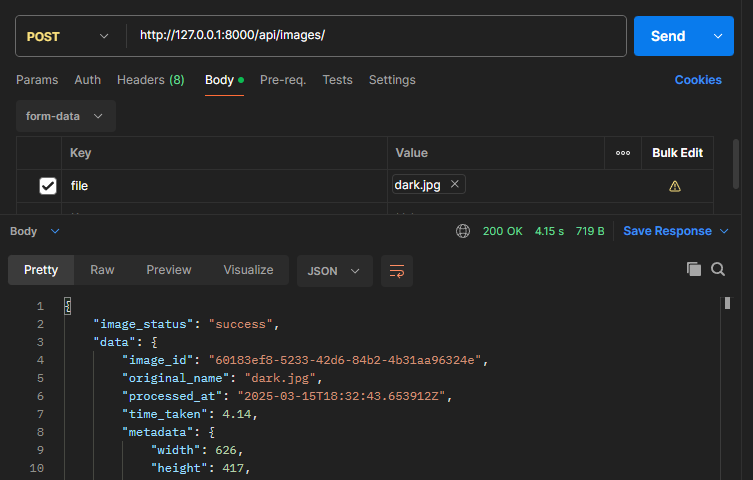
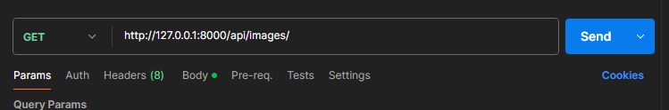
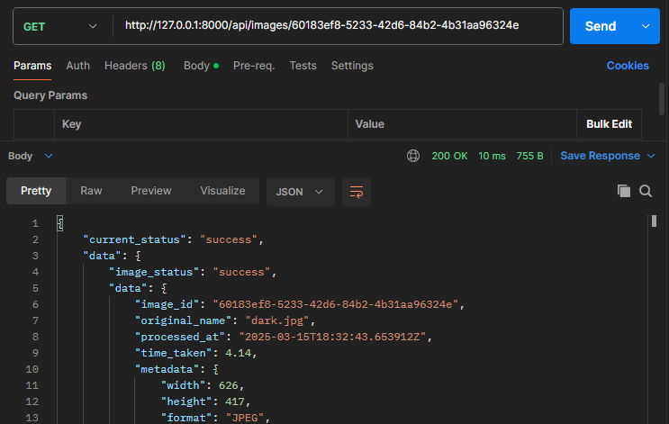
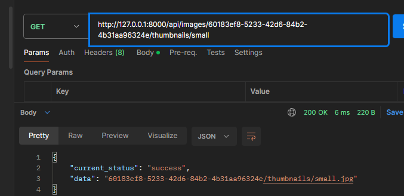

# image_processing_api
This project is a FastAPI-based image processing pipeline API that automatically processes images, generates thumbnails, extracts  metadata, and provides analysis through API endpoints.

## Table of Contents
1. [Project Overview/Structure](#project-overviewstructure)
  - [Key Features](#key-features)
  - [Process Flow](#process-flow)
2. [Installation Steps](#installation-steps)
  - [Pre-requisites](#pre-requisites)
  - [Steps](#steps)
3. [API Documentation](#api-documentation)
4. [Example Usage](#example-usage)
5. [Future Works](#future-works)

## Project Overview/Structure
The **Image Processing Pipeline API** is a FastAPI-based application that automates the processing of uploaded images. It generates thumbnails, extracts metadata, and uses AI to caption images. The processed results are made available through RESTful API endpoints.

### Key Features:
- **Image Upload**: Accepts image uploads in JPG or PNG formats.
- **Metadata Extraction**: Extracts basic metadata like dimensions, file format, and file size, and store them in memory.
- **In-Memory Storage**: Stores processesed results in memory for quick retrieval.
- **Thumbnail Generator**: Automatically generates small and medium sized thumbnails for each uploaded image.
- **AI-Powered Captioning**: Uses the [Blip Image Captioning by Salesforce](https://huggingface.co/Salesforce/blip-image-captioning-base)

### Process Flow
The flowchart below represents what happens when a file is uploaded using the API


### API Endpoints
Do refer to this [section](#api-documentation) for the API endpoints documentation.

### Technologies Used:
- **FastAPI**: For building the pipeline API.
- **Uvicorn**: For running the FastAPI server.
- **Pillow**: Used for image processing and thumbnail generation.
- **Transformers**: Used for the AI-powered image captioning.

## Installation Steps
Follow the steps to set up the project on your local machine.

### Pre-requisites
- Python 3.8 or higher
  - To verify, enter `python -V` in CMD.
- pip
- [Postman](https://www.postman.com/downloads/)

### Steps
<details>
<summary>Details:</summary>
<p>
1. **Clone this repository**
```
git clone https://github.com/your-username/your-repo-name.git
cd repo-folder
```

2. **Install Dependencies**
```
pip install -r requirements.txt
```

3. **Start the FastAPI server**</b>
- Running in CMD:
```
cd repo-folder
python3 main.py
```
- Runing in VSCode
```
Run with Debugger, choosing the options Python > FastAPI. 
```
🠪 The API will be available at http://localhost:8000 or http://127.0.0.1:8000
</p>
</details>

##  API Documentation
To view the API documentation, see [here](./Documentation/README.md) under Documentations folder.

## Example Usage
All of these are done in Postman in this section:
### 🠪 Upload an Image</b>
Send a **POST** request to **/api/images** with an image file to process it.
<details>
<summary>How To:</summary>
<p>
- In Postman, in the Body tab, for form-data input, include the **Key** as "file" and **Value* as an uploaded file in your local machine.

</p>
</details>

### 🠪 Get All Processed Image Details</b>
Send a **GET** request to **/api/images** to retrieve all images and their metadata details.
<details>
<summary>How To:</summary>
<p>
- In Postman, select the GET option, input the URL as shown and send the request.

</p>
</details>

### 🠪 Get a Specific Processed Image Details</b>
Send a **GET** request to **/api/images/{image_id}** to retrieve that image's metadata details.
<details>
<summary>How To:</summary>
<p>
- In Postman, select the GET option, input the URL as shown and send the request.

</p>
</details>

### 🠪 Get Thumbnails</b>
Send a **GET** request to **/api/images/{image_id}/thumbnails/{size} to retrieve a thumbnail (small or medium).
<details>
<summary>How To:</summary>
<p>
- In Postman, select the GET option, input the URL as shown and send the request.
- Thumbnails request can be small or medium.

</p>
</details>

## Future Works
- Creating a job queue for images coming in
- Handle the images asynchronously
- Dockerise the project

## References/Credits:
- Blip Image Captioning by Salesforce: [https://huggingface.co/Salesforce/blip-image-captioning-base]
- FastAPI Documentation: [https://code.visualstudio.com/docs/python/tutorial-fastapi]
- List of HTTP status codes: [https://en.wikipedia.org/wiki/List_of_HTTP_status_codes]
- UUID Documentation: [https://docs.python.org/3/library/uuid.html]
- Getting file's creation and modification dates: [https://docs.vultr.com/python/examples/get-file-creation-and-modification-date]
- [AI](https://chatgpt.com/) used to resolve following errors:
  - time format for when the image is processed at (eg. "processed_at": "2024-03-10T10:00:00Z")
  - resolve errors in running uvicorn
